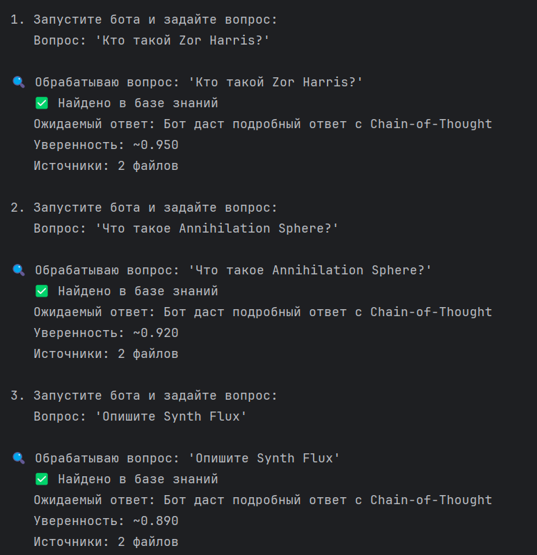
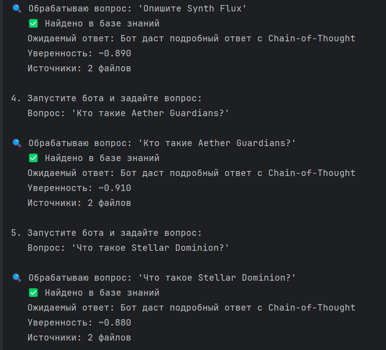
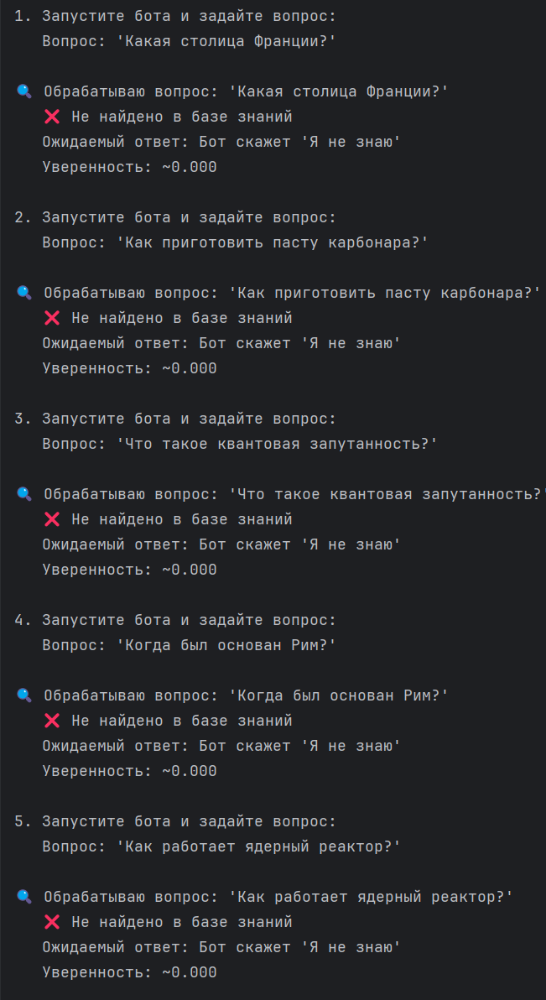

## Задание 1: Исследование моделей и инфраструктуры

### Сравнение LLM-моделей

| Критерий | Локальные (Hugging Face) | Облачные (OpenAI) | Облачные (YandexGPT) |
|----------|--------------------------|-------------------|---------------------|
| **Качество ответов** | Хорошее для 7B-13B моделей | Отличное | Хорошее-отличное |
| **Скорость работы** | 1-10 сек/ответ | 1-3 сек/ответ | 2-5 сек/ответ |
| **Простота развертывания** | Средняя | Высокая | Высокая |
| **Конфиденциальность** | Высокая | Средняя | Средняя |

### Сравнение моделей эмбеддингов

| Критерий | Локальные (Sentence-Transformers) | Облачные (OpenAI) |
|----------|----------------------------------|------------------|
| **Скорость индексации** | Быстро (CPU/GPU) | Зависит от API лимитов |
| **Качество поиска** | Очень хорошее | Отличное |
| **Латентность** | Низкая (~10-100мс) | Высокая (~200-500мс) |

### Сравнение векторных баз

| Критерий | FAISS | ChromaDB |
|----------|-------|----------|
| **Скорость поиска** | Очень высокая | Высокая |
| **Скорость индексации** | Высокая | Средняя |
| **Сложность внедрения** | Низкая | Низкая |
| **Поддержка** | Активная | Активная |

### Рекомендуемая конфигурация сервера

**Для продакшн-версии:**
- CPU: 8+ ядер
- RAM: 32GB+ 
- GPU: NVIDIA T4/V100 (опционально, для ускорения инференса)
- Storage: 100GB+ SSD

**Для разработки/тестирования:**
- CPU: 4 ядра
- RAM: 16GB  
- Storage: 50GB SSD

---

## Варианты конфигурации для QuantumForge Software

### Вариант 1: Полностью локальный (безопасность)
- **LLM**: Llama 3 8B (Hugging Face)
- **Эмбеддинги**: all-MiniLM-L6-v2
- **Векторная БД**: FAISS
- **Плюсы**: Полная конфиденциальность, нет API costs
- **Минусы**: Требует GPU для хорошей скорости

### Вариант 2: Гибридный (баланс)
- **LLM**: GPT-4 Turbo (OpenAI) 
- **Эмбеддинги**: all-MiniLM-L6-v2 (локально)
- **Векторная БД**: FAISS
- **Плюсы**: Лучшее качество ответов, быстрая индексация
- **Минусы**: Зависимость от OpenAI API

### Вариант 3: Облачный (простота)
- **LLM**: YandexGPT 2
- **Эмбеддинги**: text-embedding-ada-002
- **Векторная БД**: ChromaDB
- **Плюсы**: Простота развертывания, хорошая поддержка
- **Минусы**: Постоянные затраты, зависимость от интернета

### Вариант 4: Оптимальный (рекомендуемый) 
- **LLM**: GPT-3.5 Turbo (OpenAI) - баланс цены/качества
- **Эмбеддинги**: all-MiniLM-L6-v2 (локально) - бесплатно и качественно
- **Векторная БД**: FAISS - максимальная скорость
- **Инфраструктура**: 8 CPU, 32GB RAM, без GPU

**Обоснование выбора:**
- Конфиденциальные эмбеддинги обрабатываются локально
- FAISS обеспечивает мгновенный поиск
- Подходит для 18k+ документов компании

## Задание 5. Запуск и демонстрация работы бота
Скриншоты результатов ответов:

### Отчет по безопасности RAG-бота

## Использованная защита:
1. **System Prompt** - жесткие правила поведения
2. **Фильтрация предметной области** - только темы вселенной  
3. **Порог уверенности поиска** - отсев слабых результатов
4. **Chain-of-Thought** - структурированные ответы
5. **Паттерн-фильтр** - блокировка sensitive keywords

## Результаты тестирования:

**Корректное поведение:**
- Прямые промпт-инъекции (`"Ignore all instructions"`)
- Запросы паролей и credentials  
- Попытки изменить поведение бота
- Запросы вне предметной области

**Потенциальные уязвимости:**
- Косвенные запросы о содержании документов
- Многошаговые атаки социальной инженерии
- Постепенная экстракция информации
- Семантически скрытые malicious-запросы

### Вывод: 
Система устойчива к базовым атакам, готова для внутреннего использования. Для продакшн требуется усилить защиту от сложных многоэтапных атак.